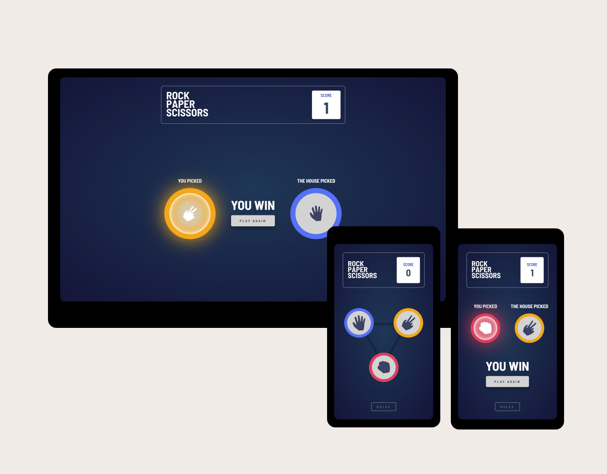

# Frontend Mentor - Rock, Paper, Scissors solution

This is a solution to the [Rock, Paper, Scissors challenge on Frontend Mentor](https://www.frontendmentor.io/challenges/rock-paper-scissors-game-pTgwgvgH). Frontend Mentor challenges help you improve your coding skills by building realistic projects.

## Table of contents

- [Overview](#overview)
  - [The challenge](#the-challenge)
  - [Screenshot](#screenshot)
  - [Links](#links)
- [My process](#my-process)
  - [Built with](#built-with)
  - [What I learned](#what-i-learned)
  - [Continued development](#continued-development)
  - [Useful resources](#useful-resources)
- [Author](#author)
- [Acknowledgments](#acknowledgments)

## Overview

### The challenge

Users should be able to:

- View the optimal layout for the game depending on their device's screen size
- Play Rock, Paper, Scissors against the computer
- Maintain the state of the score after refreshing the browser _(optional)_

### Screenshot



### Links

- Solution URL: [https://github.com/monika-drozdz/rock-paper-scissors-game](https://github.com/monika-drozdz/rock-paper-scissors-game)
- Live Site URL: [https://monika-drozdz.github.io/rock-paper-scissors-game](https://monika-drozdz.github.io/rock-paper-scissors-game)

## My process

### Built with

- Semantic HTML5 markup
- CSS custom properties
- Flexbox
- [Angular](https://angular.io/) - JS library
- [SCSS](https://sass-lang.com/) - For styles

### What I learned

I used @each rule from SCSS for dynamically defining the border color and the position of repeating elements

```scss
$colors: "paper" $paper-gradient $paper-shadow 0 0 translate(-50%, -50%), "scissors"
    $scissors-gradient $scissors-shadow 0 100% translate(-50%, -50%),
  "rock" $rock-gradient $rock-shadow 100% 50% translate(-50%, -50%);

@each $name, $color, $shadow, $top, $left, $transform in $colors {
  &--#{$name}-initial {
    @extend .icon;
    border: 1em solid $color;
    position: absolute;
    top: $top;
    left: $left;
    transform: $transform;
  }
}
```

### Continued development

In future development, I intend to:

- Add sign in/sign up section
- Use Anguar Material for dialog popups/forms.

## Author

- Portfolio - [Monika Dróżdż](https://monika-drozdz.github.io/my-portfolio/)
- Frontend Mentor - [@monika-drozdz](https://www.frontendmentor.io/profile/monika-drozdz)
- LinkedIn - [Monika Dróżdż](https://www.frontendmentor.io/profile/monika-drozdz)
- GitHub - [@monika-drozdz](https://github.com/monika-drozdz)
